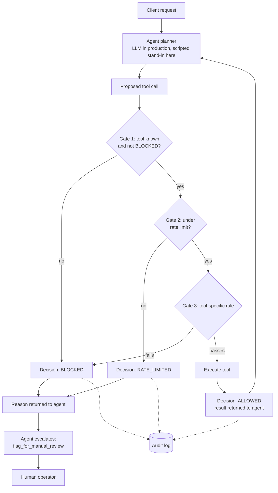

# Governed Agent Demo for a 3D Asset Optimization Pipeline

A small, dependency-free prototype that shows how to put a **governance layer** between an AI agent and the tools it can call, using an industrial 3D data pipeline as the example (scan in, compressed AI-ready asset out, delivery to the client).

The scenario is modeled on the kind of workflow a 3D data optimization platform runs: large, high-precision scans are compressed for different downstream uses such as robotics training, cloud archive, or XR streaming. All data, sizes, thresholds, and fidelity scores here are **mocked and illustrative**. Nothing in this repo reflects any company's real parameters.

## The question this answers

When a pipeline is already highly automated, the hard part of adding an agent is not getting it to call a compression function. It is deciding what the agent may do unsupervised:

- Which actions must never be possible, whatever the agent asks for?
- Which jobs are too large or risky to run without a human glancing at them?
- Can anything reach the client before it has actually been validated for its intended use?
- If the agent is stopped, does it have a proper way to hand the job to a person?

## Workflow


The same flow in text form (renders natively on GitHub):



Key design choice: **the agent decides what to try, the governance layer decides what is allowed.** Swapping the model or the agent framework does not require rewriting the rules.

## The five behaviors

| Case | Situation | Rule that fires | Outcome |
|------|-----------|-----------------|---------|
| 1 | Normal 180 MB scan for XR streaming | None, all gates pass | Compressed, validated, delivered |
| 2 | 1200 MB scan for robotics training | Size cap, checked against a trusted registry rather than the agent's own claim | Compression blocked, agent escalates to a human |
| 3 | Agent tries to deliver without validating | State check, delivery needs a fidelity validation on record | Delivery blocked |
| 4 | Agent tries to delete the client's original scan | Hard block, tool tier is BLOCKED | Never executes |
| 5 | Burst of 8 calls in a short window | Rate limit, 5 calls per 10 seconds | First 5 allowed, last 3 limited |

## Results


Across 20 proposed calls: 14 allowed, 3 blocked, 3 rate limited. The audit log records the decision type for every call, so a blocked call can be told apart from a rate-limited one when reviewing afterwards.

## Run it

```bash
python3 offline_governed_agent_demo.py     # prints every call and the full audit log
pip install matplotlib
python3 visualize_results.py                # regenerates docs/results.png
```

No API key and no network access are needed.

## Files

| File | Purpose |
|------|---------|
| `offline_governed_agent_demo.py` | Policy, mocked tools, governance gate, audit log, scripted scenarios |
| `visualize_results.py` | Runs the scenarios and draws the results timeline |
| `docs/workflow.dot`, `.png`, `.svg` | Workflow diagram source and renders |
| `docs/results.png` | Results timeline |
| `docs/presentation_script.md` | Talking points for a short walkthrough |

## Honest limitations

- The agent's decisions are **scripted** (`mock_agent_plan`), not produced by a live model. This demo shows the governance layer, not model behavior under it.
- All tools are mocks. Compression ratios, fidelity scores, thresholds, and size limits are illustrative values chosen for the demo.
- The rate limiter and validation records are in-memory and single-process. A real deployment would need persistent state, authentication, and human-approval tooling.

## Next step: a live model

Replace `mock_agent_plan` with a loop that calls an LLM with tool definitions and passes each requested tool call to `run_tool_with_governance`. The gate, policy, and audit log stay unchanged. A live run would show whether a real model attempts the risky actions and whether the gate catches them.
